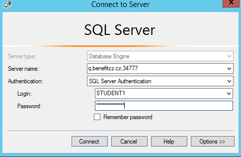

# Junior programátor, sběr pasportizačních dat budov

## Sumář (zadání od zákazníka)

* Systém pro sběr dat o kvalitě stavebních prvků budov

* Webová aplikace

* Přihlašování jménem a heslem 

## Základní funkce

* Zobrazení přehledu budov daného zákazníka

* Proklik na detailní formulář budovy
  
  * možnost zadat doplňkové vlastnosti budovy
  
  * možnost zadat data o prvcích na budově a jejich stav
  
  * uložení/odeslání změn

## Databáze k dispozici

* MS SQL Server na adrese q.benefitcz.cz, port 34777, databáze STUDENT1, **login a heslo budou zaslány individuálně**

* [Management studio](https://go.microsoft.com/fwlink/?linkid=849819) nebo [Azure Data Studio]([Azure Data Studio | Microsoft Azure](https://azure.microsoft.com/en-us/services/developer-tools/data-studio/)) - nástroj pro administraci DB, SQL dotazy

## Struktura aplikace (stránky)

* Zobrazení výpisu budov – proklik na detail (sběr dat)

* * Jako datový zdroj použijte připravené databázové view SVERENE_BUDOVY, filtrované pro s_ico 60680318
  
  * Výpis ve mřížce
  
  * proklik na detail - formulář pro sběr dat

* Formulář pro sběr dat pro jednu budovu - detail page
  
  * Vytvořte si datové struktury pro
    
    * Budovu (id, datum první kolaudace)
    
    * Číselník prvků budov - (id, název), příklad [1, Fasáda], [2, střecha] ..
    
    * Tabulku pro stav prvku budovy (id, id budovy, id druhu, známka, nutnost investice, odhad výše investice, poznámka)
  
  * možnost u budovy změnit/zadat  datum první kolaudace
  
  * zadat prvek (více prvků) a jeho atributy
    
    * druh
    
    * Známka pro stav (1-vynikající,
      2 dobrý stav, 3 – podmíněně funkční, 4 - nevyhovující)
    
    * Nutnost investice (1-není třeba, 2-v průběhu 10 let,
      3-do 3 let, 4-ihned)
    
    * Odhad výše investice (1– 0-0.5mil, 2- 0.5-3mil, 3- více jak 3 mil)
    
    * Poznámka

## V čem naprogramovat ?

* v čemkoliv :-)

* preferujeme c#, ASP.NET, ideálně využít [Visual Studio, Community edition](https://www.visualstudio.com/cs/downloads/?rr=https%3A%2F%2Fwww.google.cz%2F)

* témata ke studiu
  
  * c#
  
  * MVC, ASP.NET MVC
  
  * HTML+CSS
  
  * Bootstrap
  
  * ORM
  
  * Unit-testing
  
  * GIT

## Konzultace

Kdkoliv je možné konzultovat řešení, upřesnění zadání ... po dohodě na emailu [marekhr@benefitcz.cz](mailto:marekhr@benefitcz.cz)
